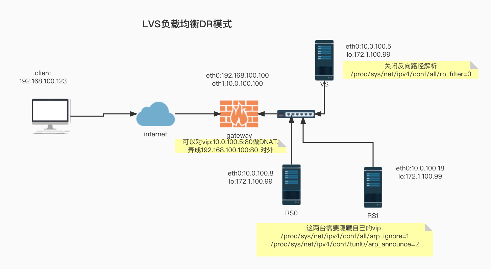

# LVS 配置相关




DR模型中各主机上均需要配置VIP，解决地址冲突的方式有三种: 

(1)在前端网关做静态绑定

(2)在各RS使用arptables

(3) 在各RS修改内核参数，来限制arp响应和通告的级别

这里采用第三种,改下面两个内核参数


限制通告级别:arp_announce
0:默认值，把本机所有接口的所有信息向每个接口的网络进行通告

1:尽量避免将接口信息向非直接连接网络进行通告 
2:必须避免将接口信息向非本网络进行通告

限制响应级别:arp_ignore
0:默认值，表示可使用本地任意接口上配置的任意地址进行响应

1:仅在请求的目标IP配置在本地主机的接收到请求报文的接口上时，才给予响应


## vs脚本:
```shell
#!/bin/bash
#
#*********************************************************
#Author:                   ez4cyka
#QQ:                       NULL
#Date:                     2022-11-23
#FileName:                 lvs_dr_vs.sh
#URL:                      https://www.google.com
#Description:              lvs负载均衡的DR模式下vs的配置
#Copyright:                2022 All rights reserved
#********************************************************


#使用前需要安装ipvsadm包

#随便选一个ip当做负载均衡虚拟ip,可以不同网段 但是netmask必须32
vip=172.1.100.99
dev=lo
port=80
#两个真实服务器的ip
rs0=10.0.100.8
rs1=10.0.100.18
#负载均衡的schedule(算法) 使用wrr (默认是wlc weighted least connection)
schedule='wrr'
#lvs的模式 使用DR (默认)
mode=g


case $1 in 

up)
	#添加vip
	ip a a ${vip}/32 dev $dev label ${dev}:1

	#添加集群服务 dr模式下 vs和rs的端口只能是一样的
	ipvsadm -A -t $vip:$port -s $schedule
	#添加rs服务器
	ipvsadm -a -t $vip:$port -r $rs0:$port -$mode
	ipvsadm -a -t $vip:$port -r $rs1:$port -$mode
	#关闭反向过滤规则，是为了防止web服务器不认识发来的拆包后的源ip把数据包给丢掉，导致web服务器丢包，客户端访问不到数据
	echo "0" > /proc/sys/net/ipv4/conf/all/rp_filter
;;

down)
	#删除lo上的vip
	ip a del ${vip}/32 dev $dev
	#清空ipvs表
	ipvsadm -C
	echo "1" > /proc/sys/net/ipv4/conf/all/rp_filter
;;


*)
	echo "Usage `basename $0` argument up|down"
	exit 1
;;
esac


```


## rs脚本:

```shell
#!/bin/bash
#
#*********************************************************
#Author:                   ez4cyka
#QQ:                       NULL
#Date:                     2022-11-24
#FileName:                 lvs_dr_rs_config.sh
#URL:                      https://www.google.com
#Description:              lvs负载均衡的dr模式中rs配置脚本
#Copyright:                2022 All rights reserved
#********************************************************

#dr模式中vip任意设,可以用跟内网ip同网段的,也可以不同网段的,但必须是32位netmask因为要加到lo网卡上
vip='172.1.100.99/32'

dev='lo'

#判断接受参数,up/down

case $1 in

up)	#DR模式基于修改mac地址进行负载均衡,所以要隐藏rs上的vip,让网关只认lvs上的vip
	#防止回应非本网口(本网口指接收到数据包的网卡)上的ip对应的mac地址
	echo 1 > /proc/sys/net/ipv4/conf/all/arp_ignore
	#防止广播自己的mac地址
	echo 2 > /proc/sys/net/ipv4/conf/all/arp_announce
	
	#逻辑网卡跟arp无关,这两条可以不加
	#echo 1 > /proc/sys/net/ipv4/conf/lo/arp_ignore
	#echo 2 >/proc/sys/net/ipv4/conf/lo/arp_announce
	

	#添加vip到lo网卡
	ip a a $vip dev $dev label ${dev}:1
;;


down)
	echo 0 > /proc/sys/net/ipv4/conf/all/arp_ignore
	echo 0 > /proc/sys/net/ipv4/conf/all/arp_announce
	#echo 0 > /proc/sys/net/ipv4/conf/lo/arp_ignore
        #echo 0 >/proc/sys/net/ipv4/conf/lo/arp_announce
	
	ip a del $vip dev $dev


;;


*)
	echo "Usage: `basename $0` argument  up|down"
	exit 1


;;


esac

```