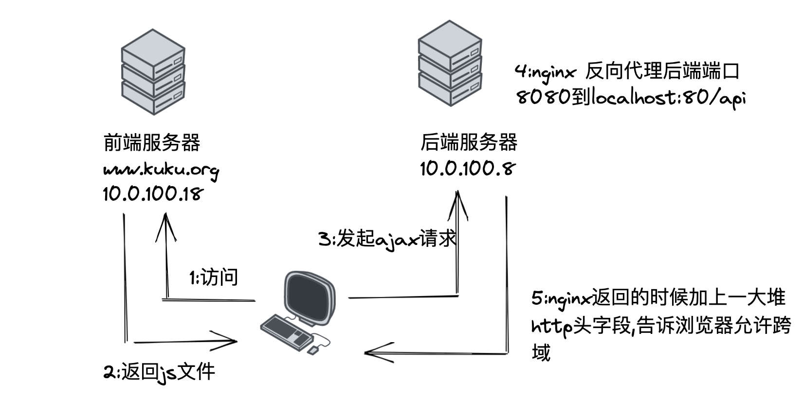
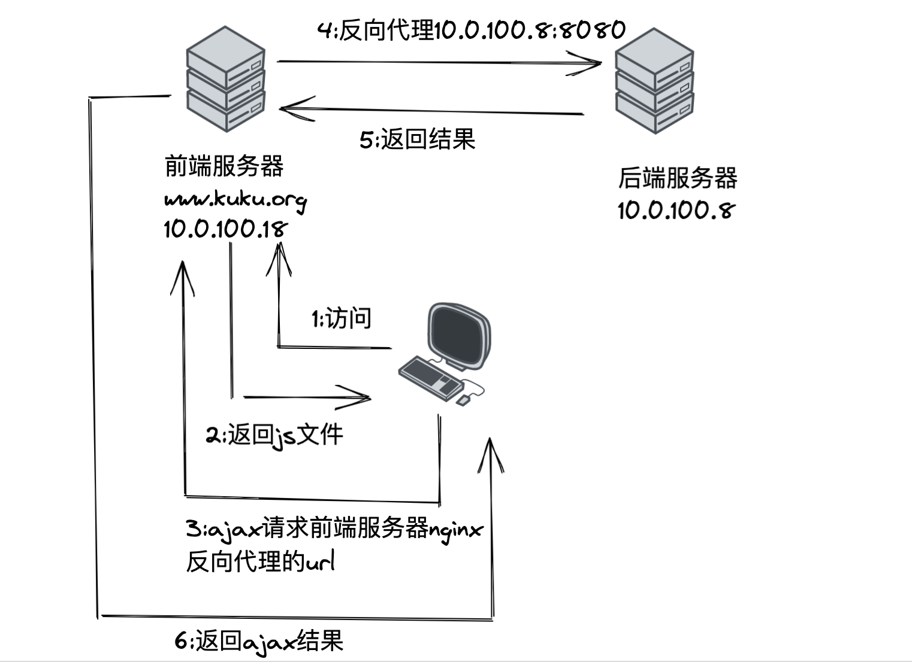

# 跨域问题的解决


## CORS

---

CORS是一个W3C标准，全称是跨域资源共享(Cross-origin resource sharing)。它允许浏览器向跨源服务器，发出XMLHttpRequest请求，从而克服了AJAX只能同源使用的限制。

简单来说就是跨域的目标服务器要返回一系列的Headers，通过这些Headers来控制是否同意跨域。
CORS提供的Headers，在Request包和Response包中都有一部分:


```
#HTTP Response Header
Access-Control-Allow-Origin
Access-Control-Allow-Credentials
Access-Control-Allow-Methods
Access-Control-Allow-Headers
Access-Control-Expose-Headers
Access-Control-Max-Age
#HTTP Request Header
Access-Control-Request-Method
Access-Control-Request-Headers
```

其中Access-Control-Allow-Headers一般包含基本字段，如Cache-Control、Content-Language、Content-Type、Expires、Last-Modified、Pragma；对于其他字段，就必须在Access-Control-Expose-Headers里面指定。


## 跨域处理方式

---

一般来说有这几种

1. 让后端直接把这几个允许跨域的http头再返回的时候加上




2. 在后端服务器把服务端口反向代理之后,用nginx加上述的http头(前端直接请求80端口的不同路径来访问接口)


3. 前端的web服务器上的nginx来反向代理ajax的请求,这样ajax直接请求自己的web服务器,再由nginx反向代理后端的服务,这样就相当于不跨域了,因为地址栏和异步请求的地址都是同一个


--- 
对应上面第二条 : 后端服务器上的nginx配置

前端请求 10.0.100.8:80/api/hello 就相当于请求了 10.0.100.8:8080/api/hello

```
server {
        listen       80;
        server_name  www.kuku.org;

        #charset koi8-r;

        #access_log  logs/host.access.log  main;

        location / { 
            root   /data/nginx/html/pc;                                                               index  index.html index.htm;
        }
    

        location /api{                                                                
        add_header 'Access-Control-Allow-Origin' '*';
        add_header 'Access-Control-Allow-Methods' 'GET, POST, OPTIONS, PUT, DELETE';
        add_header 'Access-Control-Allow-Headers' 'Content-Type'; 
        #在location处添加以下内容
        if ($request_method = 'OPTIONS') {
        return 200;
}
        proxy_pass http://localhost:8080;

        proxy_set_header Host $host;
        proxy_set_header X-Real-IP $remote_addr;
        proxy_set_header X-Forwarded-For $proxy_add_x_forwarded_for;
        proxy_set_header X-Forwarded-Proto $scheme;
        proxy_connect_timeout 5;

}
}
```


---

对应上面第三条 : 前端服务器上的nginx配置,实现不跨域


```
location /api {
 
          proxy_pass http://10.0.100.8:8080;
             }

```
前端请求自己web服务器:www.kuku.com/api 相当于请求了后端服务器的http://10.0.100.8:8080 端口


